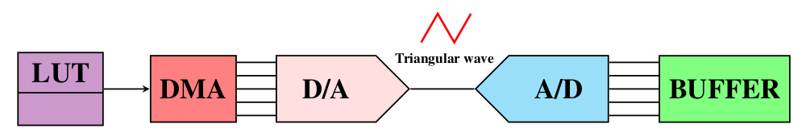
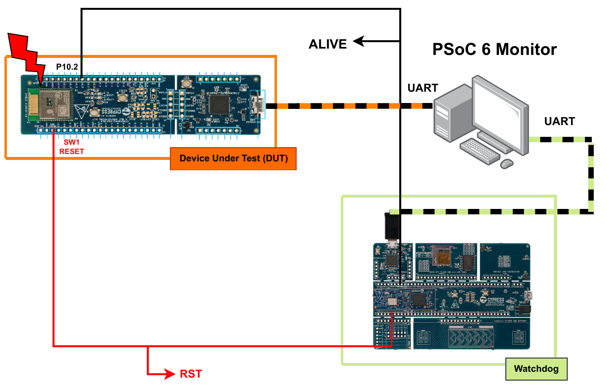

# Error Detection (Device Under Test)

This repository is part of my Graduation Project in Electrical Engineering, entitled ["Radiation Fault Detection System for SEE in a Mixed-signal Programmable SOC"](doc/graduation_thesis.pdf).

The hardware used for this part of the system is a PSoC 6 version mounted in the CY8CPROTO-063-BLE Infineon development kit.

Figure 1 summarizes the fault detection system configuration inside the main device.
It illustrates the connections of the utilized peripherals and the data flow, starting from the left
in the LUT as digital samples, transferred to a DAC via a DMA, becoming an analog triangular
wave voltage signal, captured by an ADC and stored in a buffer as digital samples again, before
eventually being evaluated by the ARM processor.

**Figure 1. PSoC Creator block diagram**

## Compilation

This project was develop using the Infineon PSoC Creator program.

## Files path:
* psoc6\_dut.cydsn/main\_cm4.c
* psoc6\_dut.cydsn/psoc6\_dut\_src/buffer.c
* psoc6\_dut.cydsn/psoc6\_dut\_src/buffer.h
* psoc6\_dut.cydsn/psoc6\_dut\_src/gheader.h
* psoc6\_dut.cydsn/psoc6\_dut\_src/serial.c
* psoc6\_dut.cydsn/psoc6\_dut\_src/serial.h
* psoc6\_dut.cydsn/psoc6\_dut\_src/trainingData.c
* psoc6\_dut.cydsn/psoc6\_dut\_src/trainingData.h

## Monitoring System

The objective of my graduation project was to develop a fault monitoring system
in order to identify soft errors in a commercial off-the-shelf (COTS) device (PSoC 6 from Infineon).

The proposed system, illustrated in Figure 2, is essentially composed of three elements: the main device or
device under test, in this case the SOC that will be operating in a radiation environment or under
a particle accelerator beam; a second device, which will act as an external watchdog for the main
device and serve as an auxiliary driver; and finally, a monitoring computer program, which will
manage both devices, coordinate log acquisition and automate the monitoring process.

A fully description of how the system works starts at page 47.

**Figure 2. Monitoring system**

## System repositories

* [Main device (DUT)](https://github.com/eduardofabbris/error_detection)

* [External Watchdog](https://github.com/eduardofabbris/external_watchdog)

* [Monitoring Software](https://github.com/eduardofabbris/psoc_monitor)
